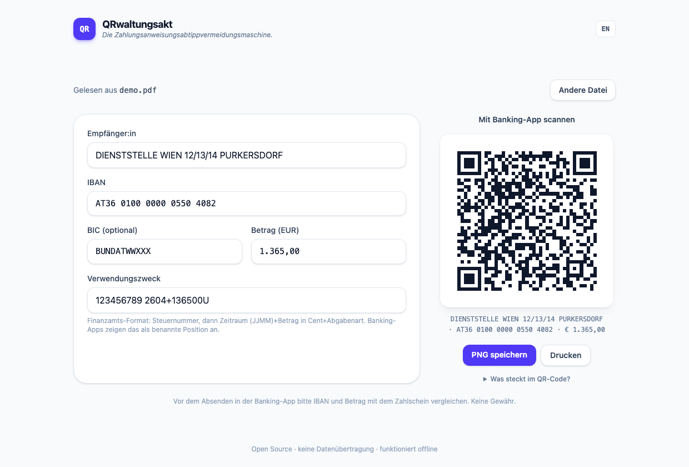

# QRwaltungsakt

**Die Zahlungsanweisungsabtippvermeidungsmaschine.**
*(Finanzamt-Zahlschein → QR-Code für deine Banking-App.)*

[](https://github.com/sebastianmarschall/QRwaltungsakt/actions/workflows/deploy.yml)
[](LICENSE)
[](https://sebastianmarschall.github.io/QRwaltungsakt/)

**▶ App öffnen: [sebastianmarschall.github.io/QRwaltungsakt](https://sebastianmarschall.github.io/QRwaltungsakt/)**



Zahlungsanweisungen des österreichischen Finanzamts kommen als PDF. QRwaltungsakt liest
Empfänger, IBAN, Betrag, Steuernummer und Abgabenart aus der PDF und erzeugt
daraus einen [EPC-QR-Code](https://de.wikipedia.org/wiki/EPC-QR-Code)
("GiroCode"), den österreichische Banking-Apps (George, ELBA, easybank, …)
direkt scannen. Kein Abtippen mehr.

## Datenschutz / Trust Model

**Deine Daten verlassen nie dein Gerät.** Das ist überprüfbar, nicht nur
versprochen:

- **Kein Server.** QRwaltungsakt ist eine statische Web-App. Die PDF wird mit einer
  lokal gebündelten Kopie von [pdf.js](https://mozilla.github.io/pdf.js/)
  direkt im Browser gelesen.
- **Strikte Content-Security-Policy.** Die App *darf* keine Verbindungen zu
  fremden Servern aufbauen (`connect-src 'self'`, kein CDN, keine externen
  Fonts, kein Tracking). Siehe `index.html`.
- **Funktioniert offline.** QRwaltungsakt ist eine installierbare PWA. Einmal geladen,
  kannst du das Internet ausschalten – die App funktioniert weiter.
- **Open Source.** Der gesamte Code liegt in diesem Repository. Der
  Netzwerk-Tab in den DevTools bleibt nach dem Laden leer.
- **Reproduzierbarer Build.** Du musst nicht einmal dem Deployment vertrauen –
  bau die Seite selbst und vergleiche sie mit dem, was online ausgeliefert
  wird:

  ```bash
  git clone https://github.com/sebastianmarschall/QRwaltungsakt && cd QRwaltungsakt
  npm ci
  BASE_PATH=/QRwaltungsakt/ npm run build
  # z. B. das gelieferte JS-Bundle mit dem lokalen vergleichen:
  curl -s https://sebastianmarschall.github.io/QRwaltungsakt/assets/$(ls dist/assets | grep '^index-.*\.js$') \
    | diff - dist/assets/$(ls dist/assets | grep '^index-.*\.js$') && echo "identisch ✓"
  ```

## Entwicklung

```bash
npm install
npm run dev      # Dev-Server
npm test         # Unit-Tests (Parser, EPC-Payload, IBAN)
npm run build    # Statischer Build nach dist/
npm run preview  # Build lokal serven
```

### Verifikation

- `npm test` prüft den Parser gegen eine anonymisierte Extraktion eines echten
  Zahlscheins und den EPC-Payload gegen ein Golden Sample.
- `node scripts/verify-qr.mjs` rendert den QR-Code und decodiert ihn mit einem
  unabhängigen Decoder (jsQR) – Payload-Vergleich Byte für Byte.
- `node scripts/extract-fixture.mjs <pdf>` extrahiert Text-Items aus einer
  echten PDF. Echte PDFs sind via `.gitignore` vom Repo ausgeschlossen, sie
  enthalten persönliche Daten.
- `node scripts/generate-tax-codes.mjs <xlsx>` regeneriert
  `src/lib/taxCodes.ts` aus dem offiziellen BMF
  "Verzeichnis der Abgabenarten" (bmf.gv.at) – aktuell 187 Codes inkl.
  Zeitraumformat (MM/JJJJ, KVJ, JJJJ, …).

## Wie es funktioniert

1. **PDF-Parsing** (`src/lib/pdf.ts`, `src/lib/parser.ts`): Der Text-Layer der
   Zahlscheine ist stark fragmentiert (IBANs in 4er-Blöcken, Beträge als
   einzelne Glyphen in Rechts-nach-links-Reihenfolge). Der Parser
   rekonstruiert Zeilen über die Glyph-Koordinaten und erkennt dann
   Empfänger-IBAN (die mit BIC `BUNDATWWXXX` bzw. BAWAG-P.S.K.-BLZ `01000` –
   nicht die eigene IBAN, die ebenfalls am Zahlschein steht!), Steuernummer,
   Abgabenart (`U` = Umsatzsteuer, …), Zeitraum und Betrag inkl. Quervergleich
   mit der OCR-Kontrollzeile.
2. **EPC-Payload** (`src/lib/epc.ts`): Version 002, UTF-8, Fehlerkorrektur M.
   Der Verwendungszweck nutzt die maschinenlesbare
   Finanzamtszahlungs-Grammatik – Steuernummer, dann pro Position
   `JJMM+Betrag in Cent+Abgabenart` (z. B. `123456789 2604+136500U`), wie sie
   Banken bei echten Finanzamtszahlungen selbst schreiben. Banking-Apps wie
   George parsen das zurück in benannte Positionen ("Umsatzsteuer (U) …").
   Fehlt eine Angabe dafür, fällt QRwaltungsakt auf die menschenlesbare Form
   (`StNr. … / U 04/2026`) zurück. Hinweis: Die SEPA-End-to-End-Referenz, in
   der die Steuernummer bei nativen Finanzamtszahlungen zusätzlich reist, ist
   per EPC-QR-Code nicht setzbar.
3. **Editierbares Formular:** Alle erkannten Werte lassen sich vor dem
   Scannen prüfen und korrigieren. Bei Unklarheiten warnt die App, statt
   stillschweigend zu raten.

## Disclaimer

Vor dem Absenden in der Banking-App IBAN und Betrag mit dem Zahlschein
vergleichen. Keine Gewähr für die Richtigkeit der erkannten Daten.
